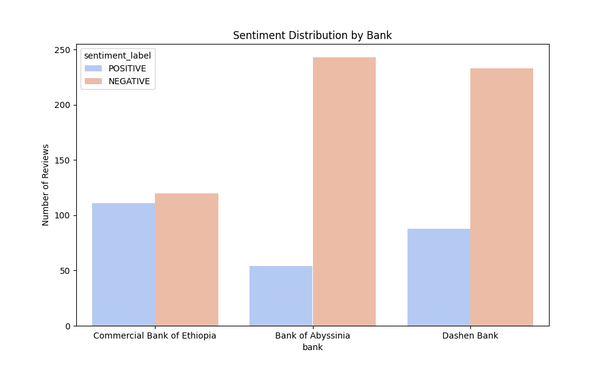
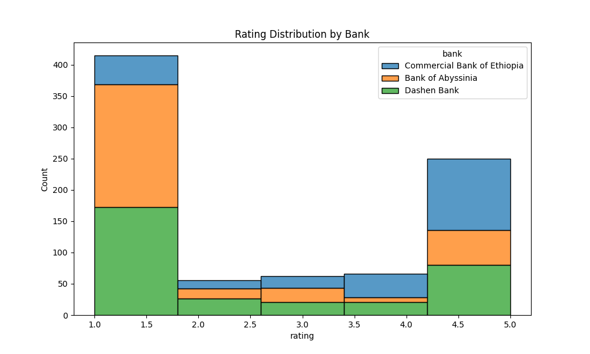
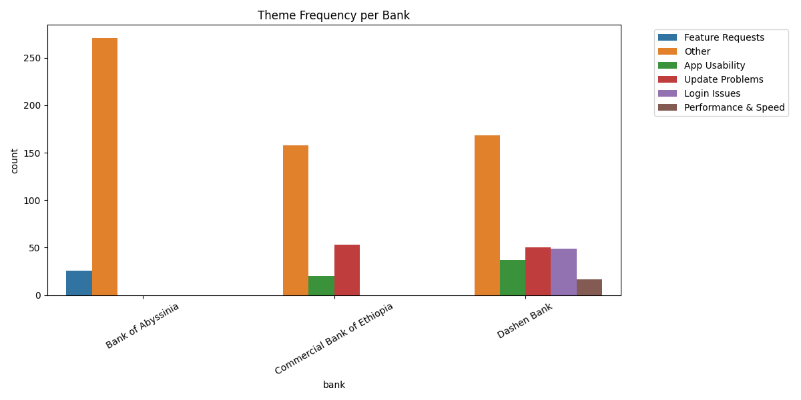

#  Customer Experience Analytics for Fintech Apps

This project provides a full pipeline for analyzing user experience and sentiment in fintech mobile app reviews. It combines natural language processing (NLP), data visualization, and topic modeling to extract insights from multilingual (English + Amharic) reviews collected from app stores.

---

## Project Overview

This solution is part of a 10 Academy AI Mastery program. It includes:

-  **Task 1: Data Loading, Cleaning, and Exploration**
-  **Task 2: Sentiment Analysis**
-  **Task 3: Thematic Analysis using Topic Modeling**
-  **Task 4: Insights, Visualizations, and Ethical Considerations**

---

##  Folder Structure

```bash
customer_experience_analytics_for_fintech_apps/
├── data/
│   ├── cleaned/
│   │   ├── all_banks_reviews_clean.csv
│   │   ├── bank_of_abyssinia_reviews_clean.csv
│   │   ├── commercial_bank_of_ethiopia_reviews_clean.csv
│   │   └── dashen_bank_reviews_clean.csv
│   ├── bank_of_abyssinia_reviews.csv
│   ├── commercial_bank_of_ethiopia_reviews.csv
│   └── dashen_bank_reviews.csv               # Original raw datasets
├── outputs/
│   ├── sentiment/
│   │   ├── all_banks_sentiment.csv
│   │   ├── reviews_with_sentiment.csv
│   │   └── sentiment_by_bank_and_ratings.csv  # Reviews with sentiment scores and labels
│   ├── themes/
│   │   ├── reviews_with_themes.csv
│   │   └── theme_summary_per_bank.csv          # Thematic clustering outputs (topics/themes)
│   └── visuals/
│       ├── rating_distribution.png
│       ├── sentiment_distribution.png
│       └── theme_frequency.png
├── src/
│   ├── cleaning.py                 # Data cleaning and normalization
│   ├── merge_sentiment.py          # Merge datasets with sentiment scores
│   ├── preprocessing.py            # Possibly general preprocessing utilities
│   ├── scraping.py                 # Data scraping scripts
│   ├── sentiment_analysis.py       # Sentiment model and scoring
│   └── topic_modeling.py            # BERTopic-based theme extraction
|---db/
|   └── db_config.py
|   └── inset_reviews.py
|   └── sample_data_reviweer.py
|   └── schema.sql
├── notebooks/
│   ├── analysis.ipynb
│   ├── database_insertion.ipynb
│   ├── scrap_and_save.ipynb
│   ├── visual_analysis.ipynb
│   └── visual.ipynb
├── README.md
├── requirements.txt
├── .gitignore
└── LICENSE

````

---

##  Requirements

Python ≥ 3.10
Install dependencies with:

```bash
pip install -r requirements.txt
```

Key packages:

* `pandas`, `matplotlib`, `seaborn`
* `nltk`, `scikit-learn`
* `BERTopic`, `sentence-transformers`
* `wordcloud`, `unidecode`

---

##  Tasks Summary

###  Task 1: Data Preparation

* Cleaned raw app reviews.
* Standardized rating and language fields.
* Converted dates, normalized Amharic/English text.

###  Task 2: Sentiment Analysis

* Used a multilingual Transformer model to classify reviews into `POSITIVE` or `NEGATIVE`.
* Output: `reviews_with_sentiment.csv`

###  Task 3: Topic Modeling (Themes)

* Used `BERTopic` to group reviews into semantic themes (e.g., *Login Issues*, *App Usability*).
* Applied keyword-based rule mapping to label topics.
* Output: `bank_themes_bertopic.csv`, `reviews_with_themes.csv`

###  Task 4: Visual Insights & Ethics

*  Created charts for:

  * Sentiment over time
  * Review count by theme
  * Sentiment distribution by bank
  * Rating histograms
  * Theme × Sentiment heatmaps

*  Suggested Improvements:

  * Improve **login reliability**
  * Reduce **crash frequency**
  * Add features like **budget tracking**, **statements**
  * Simplify **user interface**

*  Ethical Notes:

  * Review bias exists (users write mostly when angry or excited).
  * Multilingual NLP challenges.
  * Class imbalance between negative/positive reviews.

---

## Sample Visuals

## Visualizations

### sentiment distribution


### Rating distributions by bank


### theme frequiency 



---

## Key Insights

* **Drivers**: Fast navigation, simple interface, intuitive UX.
* **Pain Points**: Login/OTP failures, crashes, failed updates.
* **Top Negative Sentiment Themes**: Update Problems, Login Issues, App Bugs.

---

## Output Files

| File                         | Description                   |
| ---------------------------- | ----------------------------- |
| `reviews_with_sentiment.csv` | Reviews + Sentiment scores    |
| `bank_themes_bertopic.csv`   | Theme summary per bank        |
| `reviews_with_themes.csv`    | Merged sentiment + theme info |
| `*.png`                      | Visual insight plots          |

---

## Authors & Credits

Developed by **Nurye Nigus** 
Electrical and AI engineer.

---

## Contact

Have suggestions or feedback?
Open an issue or reach out via [LinkedIn](https://www.linkedin.com/in/nryngs).

---

